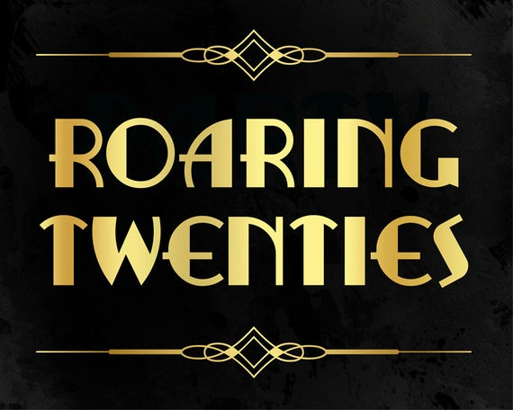
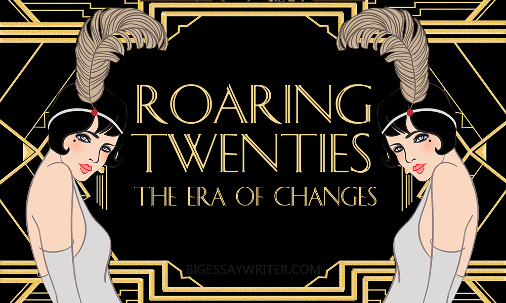

<h1>"The Roaring Twenties"<h1>
<h2>Interactive Music Mixer Project for Term 2 of IDP</h2>

Welcome to the "roaring twenties" themed music mixer drag and drop game! Have you ever wanted to feel like your own DJ? Well here you go!
How To Play:
Simple!
1.click on one of the instrument icons
2.drag it over to the left and release
3.repeat this process until the square is full or you have created an awesome beat!

Hint: fill the square with exclusively 2020's neon icons and watch the background change.

Built with:
Html 
css 
js 

Credits: 
Head Developer: Haley Billson  
Head Designer: Emily Morgan 
